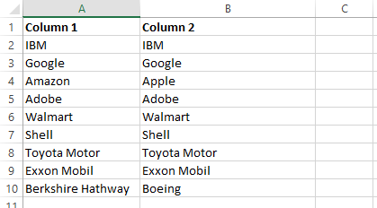
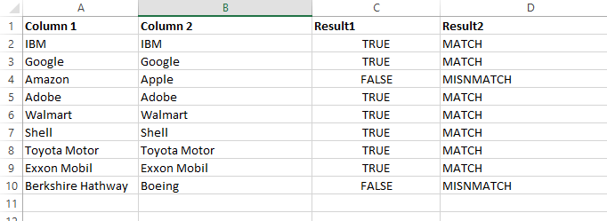
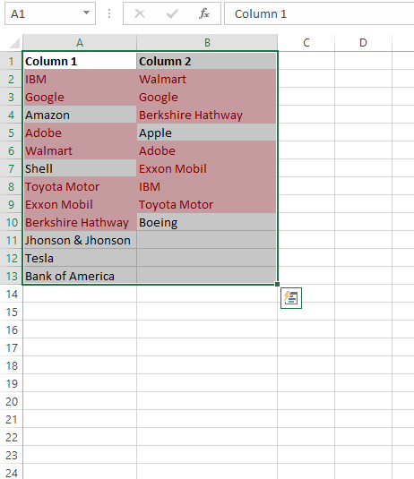
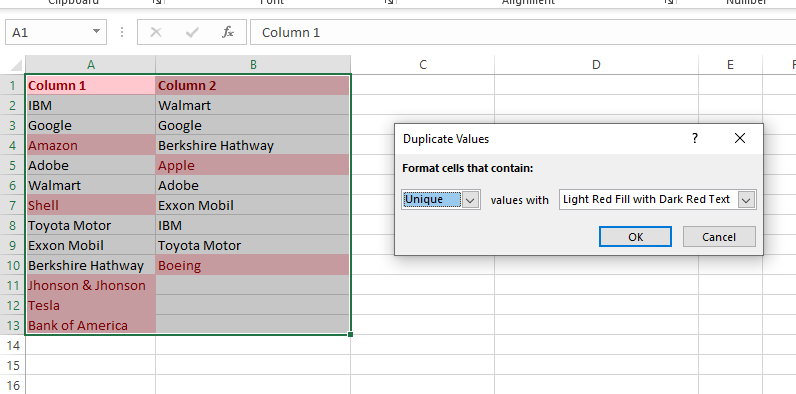
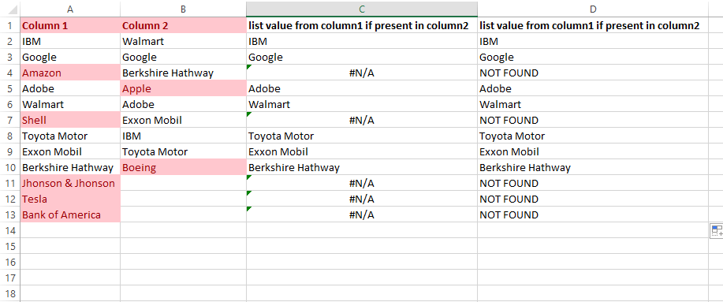
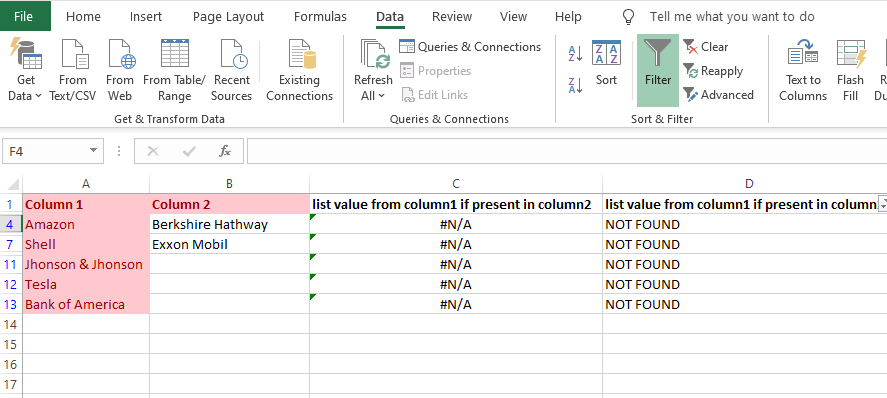
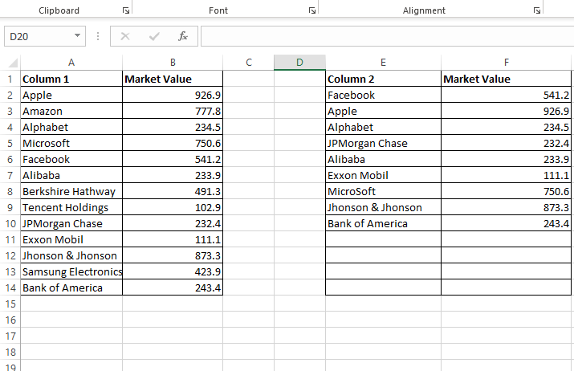
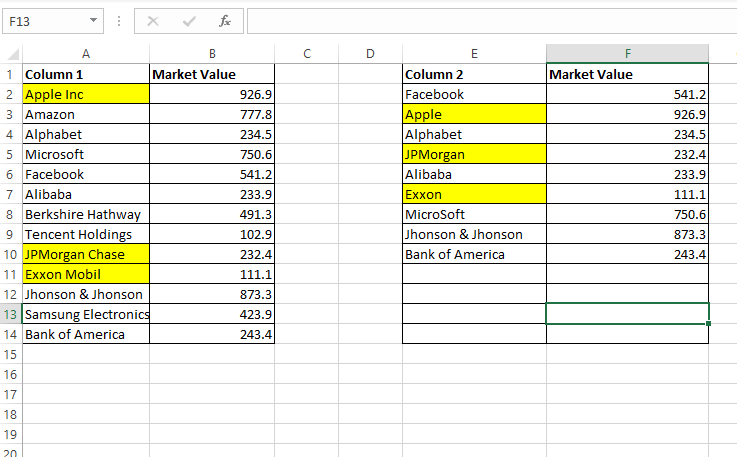

# Find duplicate values

[Refrence link](https://trumpexcel.com/compare-two-columns/#Example-Highlight-Rows-with-Matching-Data)

[Excel File used for refrence](images/1.0_find_duplicate_values.xlsx)

### Example: Compare Cells in the Same Row:

**initial set to compare**:



Result column formula used: 
```text
=A2=B2
```
### Example: Compare Cells in the Same Row (using IF formula)
```text
=IF(A5=B5,"MATCH","MISNMATCH")
```



### Example: Highlight Rows with Matching Data


Select entire dataset -> click on Home -> Conditional Formatting -> Highlight Cell Rules -> Duplicate Values -> Format Cells



- it will highlight company names which are present in both columns, no matter which row
- conditional formatting rule are not case sensitive


### Example: Compare Two Columns and Highlight Mismatched Data

Select entire dataset -> click on Home -> Conditional Formatting -> Highlight Cell Rules -> Duplicate Values -> Select **UniQue** -> Format Cells




- It highlights all the cells that have a name that is not present on the other list.


### Compare Two Columns and Find Missing Data Points

- If you want to identify whether a data point from one list is present in the other list, you need to use the **vlookup** formulas.
- here we find names which are in column1 but not in column 2

**vlookup definition**:
```text
A VLOOKUP function exists of 4 components:

The value you want to look up;
The range in which you want to find the value and the return value;
The number of the column within your defined range, that contains the return value;
0 or FALSE for an exact match with the value your are looking for; 1 or TRUE for an approximate match.
Syntax: VLOOKUP([value], [range], [column number], [false or true])
```

```text
=IFERROR(VLOOKUP(A2,B:B,1,0),"NOT FOUND")
```

- NOTE: when using this formula and after you select range, use F4 so that for your next match range doesn't move down) 




- we can filter values and check for "Not Found" in result column - this gives all values in column1 which are not found in column 2.




### Compare Two Columns and Pull the Matching Data

- If you have two datasets and you want to compare items in one list to the other and fetch the matching data point, you need to use the lookup formulas.

#### Example: Pull the Matching Data (Exact)

```text
=VLOOKUP(E2,A:B,2,0)
```




#### Example: Pull the Matching Data (Partial Match)

```text
=VLOOKUP(E2&"*",A:B,2,0)
```




