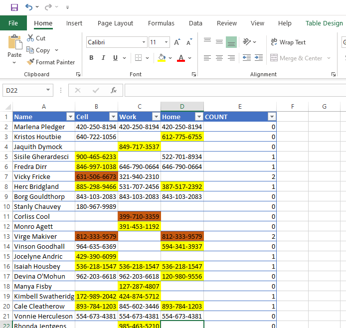

## find duplicate values in different worksheet

[Reference link](https://www.excelcampus.com/tips/compare-sheets-duplicates)

[Excel Sheet used](images/1.1_compare_values_different_worksheet.xlsx)

- Learn how to compare two worksheets for duplicate values by highlighting the cells with conditional formatting.  Also highlight values in a different color when there are more than two duplicates.

- we are using COUNIF function first to check if value we are trying to find in another sheet is present and how many times it occurs. 
- to start with we will create a new column with COUNT and apply formula to it. 
- COUNTIF has two arguments. The first is range and the second is criteria. Range is the group of cells that you want to look in to find a specific value.The criteria argument is simply the value that we are looking for.
- If the value that is found in cell B2 is also found in our designated range on the Historical tab, the COUNTIF function will return a number greater than zero. If it is NOT found on that sheet, it will return a zero.
- apply formula COUNTIF -> select all cells in other Historical sheet(Ctrl +Shift +End) -> presee F4( so that range is absolute) -> then add comma and select single B2 cell. 
```text
=COUNTIF(Historical!$B$2:$F$1001,B2)
```


- Apply this to other rows in column COUNT
- next select all cells in current sheet and apply conidtional formatting with formula. 
- To see results for numbers where occurence is more than 1 time, we can apply another conditional formatting
```text
=COUNTIF(Historical!$B$2:$F$1001,B2) >1
```

final result:


- can delete the COUNT column if not needed.